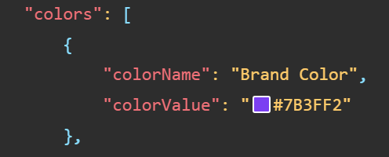
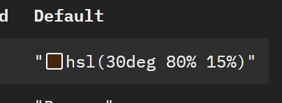
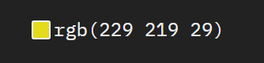
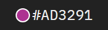
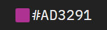
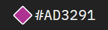

# docsify-display-colors

A [Docsify](https://docsify.js.org/#/) Plugin to visually display small color boxes next to Hexcodes, RGB- or HSL-Colors.

## Preview






## Setup


1. Add the Script to your `index.html`
	- From CDN
	```html
	<script src="https://cdn.jsdelivr.net/gh/win-tm/docsify-display-colors@main/docsify-display-colors.min.js"></script>
	```

	- From this Repo -> `docsify-display-colors.min.js`


2. Link to the Stylesheet

   - From CDN
	```html
	<link rel="stylesheet" href="https://cdn.jsdelivr.net/gh/win-tm/docsify-display-colors@main/docsify-display-colors.min.css">
	```

	- Copy Code Below
	```css
	.color-swatch {
		height: 1em;
		aspect-ratio: 1;
		margin: 0px 0.15em -0.15em;
		display: inline-block;
		box-sizing: border-box;
		border-radius: 2px;
		border: 1.5px solid #FFFFFF;
	}
	```

It will now add a Span Inline-Block Element with Class `color-swatch` in front of every Color in the Document.

## Customisation and Examples

To customise the Look of Color Swatch, just adjust the CSS Code provided above or completely create your own Styling.


### Rounded Swatches
- Set `border-radius` to `50%`
```css
.color-swatch {
	height: 1em;
	aspect-ratio: 1;
	margin: 0px 0.15em -0.15em;
	display: inline-block;
	box-sizing: border-box;
	border-radius: 50%;
	border: 1.5px solid #FFFFFF;
}
```


### Without Border
- Remove the `border`-Attribute
```css
.color-swatch {
	height: 1em;
	aspect-ratio: 1;
	margin: 0px 0.15em -0.15em;
	display: inline-block;
	box-sizing: border-box;
	border-radius: 2px;
}
```


### Diamond Shape
- Add `transform` to rotate and scale the swatch.
- Increase `margin` left and right
```css
.color-swatch {
	height: 1em;
	aspect-ratio: 1;
	margin: 0px 0.3em -0.15em;
	display: inline-block;
	box-sizing: border-box;
	border-radius: 2px;
	border: 1.5px solid #FFFFFF;
	transform: rotate(45deg) scale(0.9);
}
```



## Limitation

This current doesn't work with inline color styles as it would be replacing the css code.